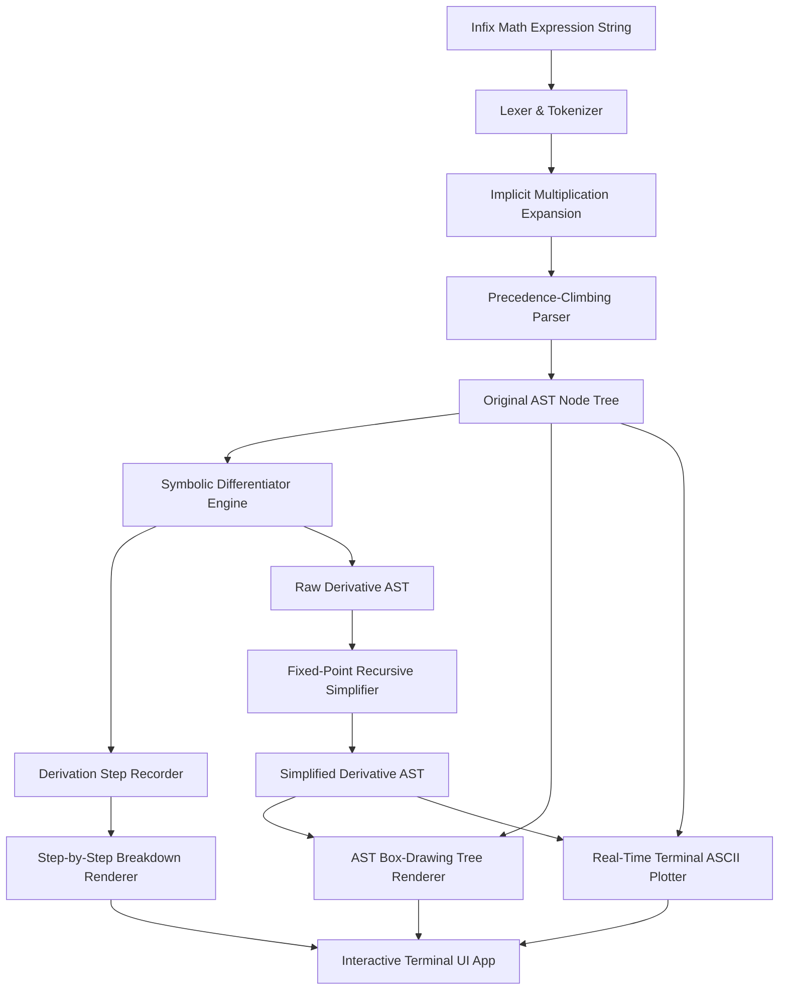

# Antigravity Calculus Engine - System Architecture Documentation

This document provides a comprehensive technical breakdown of the architecture, design patterns, data flows, and algorithms implemented in the **Antigravity Calculus Engine & Terminal UI**.

---

## 1. High-Level System Architecture

The engine is built around a modular pipeline architecture with clean separation of concerns between parsing, AST representation, symbolic computation, simplification, and terminal visualization.



---

## 2. Component Deep Dive

### 2.1 Lexing & Parsing Pipeline (`core/parser.py`)

The parsing pipeline converts raw mathematical expression strings (such as `"x^2 + 3sin(2x)"`) into strongly-typed Abstract Syntax Tree nodes.

1. **Tokenization (`tokenize`)**:
   - Uses regular expressions in [parser.py](file:///Users/danielward/Developer/Personal%20Projects/Machine%20Learning-AI/python-practice/all-projects/calculus/antigravity-flash-calculus/core/parser.py) to match numbers, variables, operators (`+`, `-`, `*`, `/`, `^`), functions (`sin`, `cos`, `tan`, `exp`, `ln`, `sqrt`), and parentheses.
   - Automatic constant substitution for $\pi$ (`math.pi`) and $e$ (`math.e`).

2. **Implicit Multiplication Insertion**:
   - Evaluates consecutive token pairs. When a number, variable, or right parenthesis is immediately followed by a variable, function, or left parenthesis (e.g. `2x`, `3sin(x)`, `(x+1)(x-1)`), an explicit multiplication token `*` is dynamically inserted.

3. **Precedence-Climbing Parser (`parse_expression`)**:
   - Implements precedence-climbing parsing in [parser.py](file:///Users/danielward/Developer/Personal%20Projects/Machine%20Learning-AI/python-practice/all-projects/calculus/antigravity-flash-calculus/core/parser.py).
   - Enforces operator precedence:
     - Functions / Parentheses / Unary Minus: Highest precedence
     - Exponentiation (`^`): Precedence 3 (Right-associative)
     - Multiplication (`*`) & Division (`/`): Precedence 2 (Left-associative)
     - Addition (`+`) & Subtraction (`-`): Precedence 1 (Left-associative)

---

### 2.2 AST Node Design & Polymorphism (`core/ast.py`)

Every node in the expression tree inherits from the abstract base class [Node](file:///Users/danielward/Developer/Personal%20Projects/Machine%20Learning-AI/python-practice/all-projects/calculus/antigravity-flash-calculus/core/ast.py), establishing a uniform polymorphic interface:

```python
class Node:
    precedence: int = 0
    def differentiate(self, var: str) -> "Node": ...
    def evaluate(self, var_map: dict) -> float: ...
    def to_string(self, parent_precedence: int = 0) -> str: ...
```

#### Node Class Hierarchy:
- **Leaf Nodes**:
  - `Constant`: Holds numeric values (`int` / `float`). Derivative is always `0`.
  - `Variable`: Represents variables (e.g. `'x'`). Derivative is `1` if variable matches target, `0` otherwise.
- **Binary Operator Nodes**:
  - `AddNode` & `SubNode`: Linear combination $(f \pm g)' = f' \pm g'$.
  - `MulNode`: Product Rule $(f \cdot g)' = f'g + fg'$.
  - `DivNode`: Quotient Rule $(f / g)' = \frac{f'g - fg'}{g^2}$.
  - `PowNode`: General Power & Exponent Rule $(f^g)' = f^g \cdot (g' \ln f + g \frac{f'}{f})$.
- **Unary / Function Nodes**:
  - `NegNode`: Unary negation $(-u)' = -u'$.
  - `SinNode`, `CosNode`, `TanNode`: Trigonometric chain rules.
  - `ExpNode`, `LnNode`, `SqrtNode`: Transcendental function rules.

---

### 2.3 Symbolic Differentiation & Derivation Step Recording (`core/differentiator.py`)

The differentiation engine in [differentiator.py](file:///Users/danielward/Developer/Personal%20Projects/Machine%20Learning-AI/python-practice/all-projects/calculus/antigravity-flash-calculus/core/differentiator.py) performs recursive tree traversal while logging formal derivation steps.

- **`DerivationStep` Structure**:
  - `rule_name`: Human-readable calculus rule (e.g., `"Product Rule"`, `"Chain Rule"`, `"Quotient Rule"`).
  - `expression`: String representation of current sub-AST node being differentiated.
  - `explanation`: Mathematical statement of the rule logic (e.g. `d/dx(u*v) = u'*v + u*v'`).
  - `result`: Raw, unsimplified AST string result.
  - `simplified_result`: Simplified AST string result after running local simplification.

- **Algorithm Flow**:
  1. Recursively traverse down to sub-trees.
  2. Compute derivative of children nodes.
  3. Combine derivative results according to calculus rules.
  4. Pass raw result to the simplifier to compute step-level simplified form.
  5. Append `DerivationStep` to step history list.
  6. Return `(raw_derivative, final_simplified_derivative, steps_list)`.

---

### 2.4 Fixed-Point Recursive Simplifier Engine (`core/simplifier.py`)

Symbolic differentiation often produces bloated expressions (e.g. `1 * x + 0 * sin(x)`). The simplification engine in [simplifier.py](file:///Users/danielward/Developer/Personal%20Projects/Machine%20Learning-AI/python-practice/all-projects/calculus/antigravity-flash-calculus/core/simplifier.py) cleans up expressions using a fixed-point loop:

```python
def simplify(node: Node) -> Node:
    current = node
    for _ in range(15):
        simplified = _simplify_pass(current)
        if str(simplified) == str(current):  # Fixed point reached!
            return simplified
        current = simplified
    return current
```

#### Simplification Rule Transformations:
- **Additive Identities**:
  - $0 + x \to x$, $x + 0 \to x$
  - $x + (-y) \to x - y$
  - $x + x \to 2 \cdot x$
- **Subtractions**:
  - $x - 0 \to x$, $0 - x \to -x$, $x - x \to 0$, $x - (-y) \to x + y$
- **Multiplicative Identities & Zero Cancellation**:
  - $0 \cdot x \to 0$, $x \cdot 0 \to 0$
  - $1 \cdot x \to x$, $x \cdot 1 \to x$
  - $-1 \cdot x \to -x$
- **Division**:
  - $0 / x \to 0$, $x / 1 \to x$, $x / x \to 1$
- **Exponents**:
  - $x^0 \to 1$, $x^1 \to x$, $0^x \to 0$, $1^x \to 1$
- **Transcendental Function Identities**:
  - $\sin(0) \to 0$, $\cos(0) \to 1$, $\tan(0) \to 0$
  - $\exp(0) \to 1$, $\ln(1) \to 0$, $\ln(\exp(x)) \to x$, $\exp(\ln(x)) \to x$
- **Constant Folding**:
  - Automatically evaluates literal sub-trees (e.g. `2 + 3` $\to$ `5`, `3 * 4` $\to$ `12`).

---

### 2.5 Terminal UI & Graphical Renderers (`tui/`)

The TUI components render AST nodes into interactive terminal output without external GUI dependencies:

1. **AST Box-Drawing Tree Visualizer ([tree_renderer.py](file:///Users/danielward/Developer/Personal%20Projects/Machine%20Learning-AI/python-practice/all-projects/calculus/antigravity-flash-calculus/tui/tree_renderer.py))**:
   - Converts the recursive node tree into Unicode tree branches using `├── `, `└── `, `│   `.

2. **Real-Time Terminal ASCII Graph Plotter ([plotter.py](file:///Users/danielward/Developer/Personal%20Projects/Machine%20Learning-AI/python-practice/all-projects/calculus/antigravity-flash-calculus/tui/plotter.py))**:
   - Generates a 2D text canvas of dimensions `width` $\times$ `height`.
   - Maps numeric range $[x_{min}, x_{max}]$ across canvas columns.
   - Evaluates $f(x)$ and $f'(x)$ at each column coordinate.
   - Maps vertical axis values $[y_{min}, y_{max}]$ into grid row indices.
   - Renders X axis (`─`), Y axis (`│`), intersection (`┼`), $f(x)$ (`*`), $f'(x)$ (`#`), and overlap (`@`).

3. **Step-by-Step Derivation View ([derivation_view.py](file:///Users/danielward/Developer/Personal%20Projects/Machine%20Learning-AI/python-practice/all-projects/calculus/antigravity-flash-calculus/tui/derivation_view.py))**:
   - Formats step objects into structured terminal cards detailing rule name, target sub-expression, rule formula, and step result.

4. **TUI Application Loop ([app.py](file:///Users/danielward/Developer/Personal%20Projects/Machine%20Learning-AI/python-practice/all-projects/calculus/antigravity-flash-calculus/tui/app.py))**:
   - State machine controller managing user input, menu options, graph domain prompts, and non-interactive demo mode execution.

---

## 3. Verification & Testing Strategy

The system is tested using standard Python `unittest` in [test_engine.py](file:///Users/danielward/Developer/Personal%20Projects/Machine%20Learning-AI/python-practice/all-projects/calculus/antigravity-flash-calculus/tests/test_engine.py):
- **Lexer/Parser Tests**: Validates tokenization, operator precedence, and implicit multiplication parsing.
- **Differentiation Tests**: Verifies correctness of Product, Quotient, Chain, Power, and Trig derivatives.
- **Simplifier Tests**: Checks identity reductions and constant folding.
- **Evaluator & Visualizer Tests**: Validates AST numerical evaluation, tree rendering, and ASCII plot generation.
